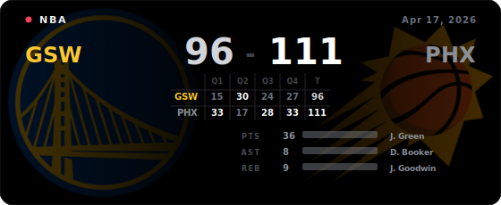

# NBA GitHub Profile Card

Generate an SVG card for the latest NBA game of a configured team. The card is designed to be embedded in a GitHub profile README.



## Setup

Add these repository settings in GitHub:

- Secret: `BALLDONTLIE_API_KEY`
- Variable: `NBA_TEAM`, for example `LAL`, `GSW`, or `BOS`
- Optional variable: `NBA_LAYOUT`, either `full` or `compact`

The workflow runs every 5 minutes, which is the shortest schedule interval supported by GitHub Actions.

## Embed In Profile README

Use the raw SVG URL from this repository:

```md

```

If your default branch is `master`, replace `main` with `master`.

## Local Run

```sh
pip install -r requirements.txt
NBA_TEAM=LAL BALLDONTLIE_API_KEY=your_key python generate.py
```

Team logos are loaded from `logos/<TEAM>.png` first. If no local file exists, the generator downloads the ESPN logo and embeds it into the SVG.
